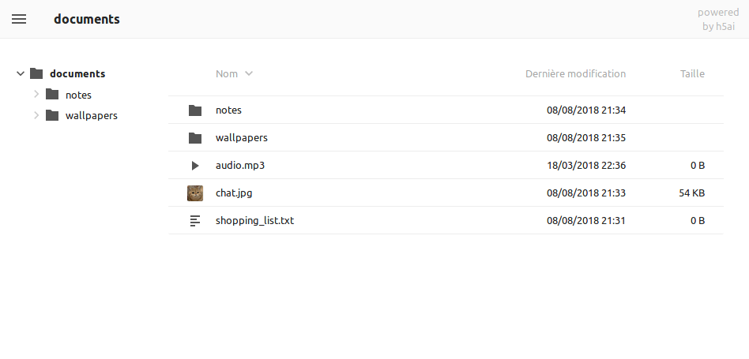

<!--
注意：此 README 由 <https://github.com/YunoHost/apps/tree/master/tools/readme_generator> 自动生成
请勿手动编辑。
-->

# YunoHost 上的 h5ai

[](https://ci-apps.yunohost.org/ci/apps/h5ai/)


[](https://install-app.yunohost.org/?app=h5ai)

*[阅读此 README 的其它语言版本。](./ALL_README.md)*

> *通过此软件包，您可以在 YunoHost 服务器上快速、简单地安装 h5ai。*  
> *如果您还没有 YunoHost，请参阅[指南](https://yunohost.org/install)了解如何安装它。*

## 概况

h5ai is a modern file indexer for HTTP web servers with focus on your files. Directories are displayed in a appealing way and browsing them is enhanced by different views, a breadcrumb and a tree overview.

### Features

Some of the optional features are: file sorting, different view modes, localization, a breadcrumb, a tree view, custom headers and footers, file filter and search, folder sizes, auto refresh, packaged download, QR codes, thumbnails, file previews


**分发版本：** 0.30.0~ynh11

**演示：** <https://larsjung.de/h5ai/demo/>

## 截图



## 文档与资源

- 官方应用网站： <https://larsjung.de/h5ai/>
- 官方管理文档： <https://larsjung.de/h5ai/>
- 上游应用代码库： <https://github.com/lrsjng/h5ai>
- YunoHost 商店： <https://apps.yunohost.org/app/h5ai>
- 报告 bug： <https://github.com/YunoHost-Apps/h5ai_ynh/issues>

## 开发者信息

请向 [`testing` 分支](https://github.com/YunoHost-Apps/h5ai_ynh/tree/testing) 发送拉取请求。

如要尝试 `testing` 分支，请这样操作：

```bash
sudo yunohost app install https://github.com/YunoHost-Apps/h5ai_ynh/tree/testing --debug
或
sudo yunohost app upgrade h5ai -u https://github.com/YunoHost-Apps/h5ai_ynh/tree/testing --debug
```

**有关应用打包的更多信息：** <https://yunohost.org/packaging_apps>
